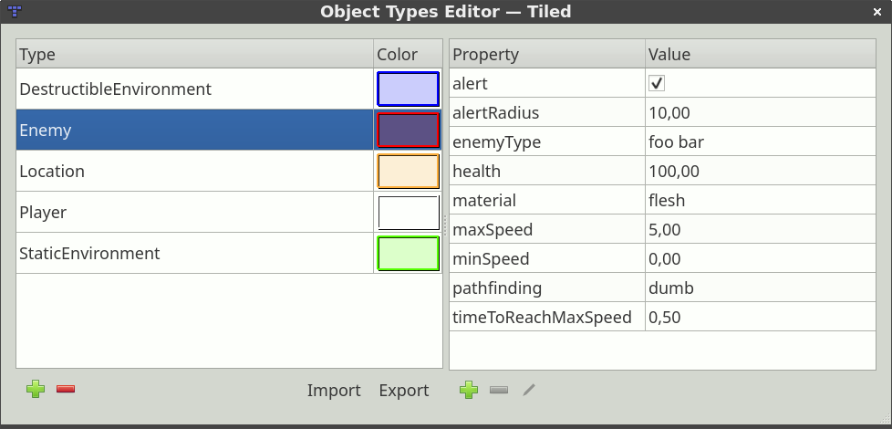

## Custom Properties

### Overview

One of the major strengths of Tiled is that it allows setting custom properties
on all of its basic data structures. This way it is possible to include many
forms of custom information, which can later be used by your game or by the
framework you're using to integrate Tiled maps.

Custom properties are displayed in the Properties view. This view is
context-sensitive, usually displaying the properties of the last selected
object. For tiles in a tileset or objects on an object layer, it also supports
multi-selection.

 

### Adding Properties

When you add a property (using the '+' button at the bottom of the Properties
view), you are prompted for its name and its type. Currently Tiled supports the
following basic property types:

* **string** (any text)
* **float** (a floating point number)
* **int** (a whole number)
* **bool** (true or false)

 

The property type is used to choose a custom editor in the Properties view.
Choosing a number or boolean type also avoids that the value will get quoted in
JSON and Lua exports.

### Predefining Properties

Usually you only use a limited set of object types in your game, and each type
of object has a fixed set of possible properties, with specific types and
default values. To save you time, Tiled allows predefining these properties
based on the "Type" field for objects. You can set this up using the Object
Types Editor, available from the _View_ menu.

 

By default, Tiled stores these object types in the user settings. However, since
you'll often want to share them with other people in your project, you can
export your object types or change the storage location of the object types
file. A simple XML file with self-explanatory contents is used to store your
object types.

The color not only affects the rendering of the various shapes of objects, but
is also the color of the label which will show up if you give your object a
name.

To make the predefined properties show up in the Properties view, all you need
to do is to enter the name of the type in the built-in "Type" property. Usually
this is what you're doing already anyway to tell your engine what kind of object
it is dealing with.

### Future Extensions

There are several types of custom properties I'd like to add:

* **File references**, which would feature a button to easily choose a file.
* **Enumerations**, where you can predefine all possible values and it forms a
  combo box ([#1211](https://github.com/bjorn/tiled/issues/1211)).
* **Object references**, which would allow easily linking objects together and
  Tiled could display such connections
  ([#707](https://github.com/bjorn/tiled/issues/707)).
* **Dictionary properties**, which would be properties that can contain any
  number of other properties as children
  ([#489](https://github.com/bjorn/tiled/issues/489)).

I'd also like to add **multi-line editing** of string properties
([#205](https://github.com/bjorn/tiled/issues/205)). And it would be nice to add
support for **limiting property values**, like length of string properties or a
minimum/maximum on number values.

Apart from predefining properties based on object type, I'd like to add support
for **predefining the properties for each data type**. So defining which custom
properties are valid for maps, tilesets, layers, etc.

Finally, the predefined properties would work very well together with explicit
**support for projects**. Then you could switch between different projects or
get started on an existing project, without needing to configure Tiled to use
the right object type definitions.

If you like any of these plans, please help me getting around to it faster by
[becoming a patron](https://www.patreon.com/bjorn?ty=h). The more support I
receive the more time I can afford to spend improving Tiled!

